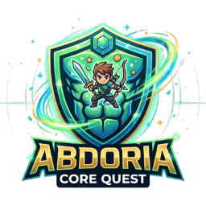

<div align="center">

# Abdoria · Core Quest



**Seu treino de abdômen virou uma aventura.**

Desenvolvi o Abdoria para treinar em casa, ganhar pontos, desbloquear conquistas, personalizar o perfil e disputar o ranking — tudo de um jeito simples e motivador.

[](https://abdoria-project.vercel.app)
[](https://github.com/RDEsley/Abdoria/releases)
[](https://react.dev/)
[](https://www.typescriptlang.org/)
[](https://nodejs.org/)
[](https://supabase.com/)

[App ao vivo](https://abdoria-project.vercel.app) · [Guia para quem vai usar o app](./docs/GUIA-DO-USUARIO.md) · [Instalação para desenvolvedores](#-instalação-rápida) · [Desenvolvedor](#desenvolvedor)

</div>

---

## O que é o Abdoria?

O **Abdoria** é um aplicativo web de treinos de **abdômen com peso corporal**. Você monta ou recebe treinos, executa exercício por exercício com timer e descanso, e acompanha sua evolução como se fosse um jogo.

Basta criar uma conta, passar pelo cadastro inicial e começar a treinar.

> **Importante:** o Abdoria é educacional e de entretenimento. **Não substitui** acompanhamento médico, nutricional ou de educação física.

---

## Para quem é?

| Perfil | O que você ganha |
|--------|------------------|
| **Iniciante** | Treinos sugeridos, exercícios explicados e progressão suave |
| **Quem treina em casa** | Biblioteca de exercícios, montagem de treino e player guiado |
| **Quem gosta de metas** | XP, streak, conquistas, loja diária e ranking |
| **Quem quer constância** | Calendário de treinos, exploração AFK e recompensas diárias |

---

## O que você pode fazer no app

### Treinar de verdade
- Biblioteca com dezenas de exercícios de core (superior, inferior, oblíquos, flexões, etc.)
- **Equipamentos opcionais** — marque na biblioteca **prancha de flexão**, **barra fixa** ou **roda abdominal** para liberar exercícios extras
- Nomes em inglês com **tradução em português** entre parênteses
- **Construtor em duas abas** — **Treinar Agora** (ciclos e sugestões) e **Criar/Personalizar** (monte o seu)
- Treinos prontos por ciclo (**A, B, C…**) com **tags de músculo** e duração estimada na barra fixa inferior
- **Treinos similares** — encontre opções com o mesmo foco muscular (presets e treinos salvos)
- **Seletor de exercícios** e lista **arrastável** para montar a fila do treino
- **Exercícios fixos** — marque na biblioteca o que sempre deve entrar na sugestão
- **Bloqueio de recomendação** — oculte exercícios que não quer ver nos treinos sugeridos
- **Treinos fixos / bloqueados** — priorize ou exclua treinos inteiros nas recomendações
- **Rodada de ciclos** — ao completar todos os ciclos ativos, escolha manter ou sortear um novo set
- **Banner de teto de XP** — aviso quando o limite diário já foi atingido (o treino continua liberado)
- **Player interativo**: séries por tempo ou repetições, descanso configurável, botões na barra inferior
- Salve treinos favoritos na sua conta

### Evoluir e se motivar
- **XP diário** — exercícios do treino (mín. **3 exercícios**; **20 XP** por exercício)
- **Teto diário** — **100 XP + 1 por nível** (+ **1 XP** por inimigo único no bestiário)
- **XP extra** — streak, conquistas, loja e habilidades desbloqueadas (sem limite diário)
- **Exploração AFK** — herói em combate automático enquanto você está fora (máx. **24h** de exploração)
  - **Loot por kill:** **4%** comum · **6%** elite · **10%** boss
  - Inimigos **slime** com variações de olhos, bocas e acessórios (chapéus, aura, coroa no boss)
  - **Bestiário** — derrote inimigos para desbloquear entradas e aumentar o teto diário de XP
  - **Golden Slime** raro — **1 em 1000** spawns, drop garantido de **10 Dorias**
  - **Rei Slime** (boss) a cada **99 kills**, com loot bônus
  - Baú com contagem de **drops por kill** (cada loot de inimigo conta separado)
  - **Loja da Exploração** — compre arcos e equipe **arco ou espada** no combate (espada básica grátis; upgrades em breve)
  - Herói mascote com **sprites animados** por arma (arco, espada; magia em breve)
  - Cenário com **ciclo dia/noite**; arma escolhida no **perfil**, na loja da exploração ou no onboarding
  - Baú de recompensas com animação ao **Coletar Recompensas** (zera o timer e recomeça a exploração)
- **Níveis**, **streak**, **conquistas** e **ranking** (XP, dias seguidos ou Dorias)
  - Abas de critério em **largura total** com **recompensas semanais** em Dorias para o top 10
  - **Countdown do reset semanal** — ranking reinicia todo **domingo às 00:00** (horário de Brasília)

### Personalizar e recompensar
- **Loja Abdoria** — avatares, bordas, fundos de HUD, títulos, sons e efeitos visuais (prévia ao vivo por item)
- **Loja da Exploração** — arcos compráveis com Dorias; **espada básica grátis** e aba de espadas (upgrades em breve); magias em breve
- **Inventário** — Energy Drinks, cosméticos, itens da exploração e gestão de **overflow** (itens além do limite)
- **Loja diária** — recompensa grátis + ofertas que renovam todo dia
- **Código presente** — resgate em **Opções**
- **Toasts de feedback** — notificações globais ao fixar/bloquear exercícios ou treinos, salvar treino, comprar itens, resgatar códigos e equipar cosméticos
- **Perfil do herói** — abas **Dados**, **Progresso** (estatísticas e zonas musculares) e **Definição** (simulador educativo)
- **Bestiário** — galeria de inimigos da exploração desbloqueados na ficha do herói

---

## Como funciona a “gamificação”?

Pense em **dois tipos de pontos**:

| Tipo | O que é | Limite |
|------|---------|--------|
| **XP diário** | Pontos dos exercícios do treino | Teto = **100 + 1 × nível** (+ **1** por inimigo no bestiário) |
| **XP extra** | Bônus de streak, conquistas, loja, habilidades (+1 XP por habilidade nova) | Sem teto diário |

A moeda **Dorias** você usa na loja de cosméticos e na loja diária. Você ganha **1 Doria a cada 10 XP** totais acumulados (conversão passiva ao longo do progresso).

Detalhes completos no **[Guia do usuário](./docs/GUIA-DO-USUARIO.md)**.

### Exploração AFK — loot por kill

**Chance de dropar algo (por kill):**

| Tier | Chance |
|------|--------|
| Comum | 4% |
| Elite (~12% dos spawns) | 6% |
| Boss (a cada 99 kills) | 10% |

**Quando o drop acerta:**

| Recompensa | % do drop | Comum (efetivo/kill) | Elite | Boss |
|------------|-----------|----------------------|-------|------|
| +1 XP | 85% | 3,40% | 5,10% | 8,50% |
| +1 Dorias | 11% | 0,44% | 0,66% | 1,10% |
| +1 Energy Drink | 4% | 0,16% | 0,24% | 0,40% |
| Cosmético lendário | 0,04% / 0,08% boss | ~0,0016% | ~0,0024% | ~0,008% |
| Título secreto | 0,01% | ~0,0004% | ~0,0006% | ~0,001% |

Offline: ~**8 kills/min** de exploração. Boss a cada **99** inimigos com loot bônus.

**Inimigos especiais:**

| Inimigo | Como aparece | Recompensa |
|---------|----------------|------------|
| Elite | ~12% dos spawns | Loot com chance **6%** por kill |
| **Golden Slime** | **1 em 1000** inimigos | **10 Dorias** garantidos (sem rolagem normal de loot) |
| **Rei Slime** (boss) | A cada **99** kills | Loot com chance **10%** por kill |

**Loja da Exploração** (`/api/patrol-shop`): arcos compráveis com Dorias; **espada de treino** grátis com alternância arco/espada no combate. Upgrades de espada e magias estão marcados como *em breve*.

**Combate por arma:** arco dispara mais rápido com maior chance de crítico (~**18%**, streak crescente); espada causa mais dano por golpe com crítico ~**6%** (+4). O bônus da arma equipada na loja soma ao dano base.

---

## Estrutura do projeto

```
Abdoria/
├── .github/workflows/      → CI (ex.: keep-supabase-alive)
├── client/                 → Interface (React + Vite + Tailwind)
├── server/src/
│   ├── domain/             → Facades de domínio (User, Exercise, …)
│   ├── repositories/       → Acesso ao Postgres (Supabase)
│   ├── db/seeds/           → Dados iniciais + `npm run seed`
│   ├── routes/             → Endpoints REST
│   └── services/           → Regras de negócio
├── shared/
│   ├── afk/                → Combate AFK, bestiário, slimes, boss/loot
│   ├── equipment/          → Catálogo de equipamentos opcionais
│   ├── patrol/             → Catálogo da Loja da Exploração (arcos/espadas)
│   ├── types/              → Contratos compartilhados (API, domínio)
│   └── utils/              → Utilitários (timezone, user-dados, afk)
├── supabase/migrations/    → Schema Postgres
├── api/                    → Entrada serverless na Vercel
├── docs/                   → Documentação amigável
└── scripts/                → Setup, build e deploy (`scripts/dev/` = ferramentas locais)
```

---

## Instalação rápida

> Seção para **desenvolvedores** ou quem for rodar o app no próprio computador.

### Pré-requisitos

- [Node.js](https://nodejs.org/) **20.x** (veja [`.nvmrc`](./.nvmrc))
- Projeto no [Supabase](https://supabase.com/) com Postgres

### Banco de dados (Supabase Postgres)

O Abdoria usa **Supabase Postgres** como único banco. Antes do primeiro `seed`, aplique o schema:

1. Crie um projeto em [supabase.com](https://supabase.com/)
2. No **SQL Editor**, execute os arquivos em [`supabase/migrations/`](./supabase/migrations/) na ordem:
   - `20250620000000_initial_schema.sql`
   - `20250620120000_afk_combat.sql` (coluna `combat` na exploração AFK)
   - `20250627120000_exercise_equipment.sql` (coluna `equipamento` nos exercícios)  
   (ou use `supabase db push` se tiver o [Supabase CLI](https://supabase.com/docs/guides/cli) linkado ao projeto)

### Passos

```bash
git clone https://github.com/RDEsley/Abdoria.git
cd Abdoria
npm install
cp server/.env.example server/.env
# Edite server/.env: SUPABASE_URL, SUPABASE_SERVICE_ROLE_KEY, JWT_SECRET
npm run seed
npm run dev
```

| Serviço | Endereço local |
|---------|----------------|
| App (navegador) | http://localhost:5173 |
| API | http://localhost:3001 |
| Saúde da API | http://localhost:3001/api/health |

**Conta demo** (após `npm run seed` em ambiente **não produção**):

| E-mail | Senha |
|--------|-------|
| `admin@abdoria.local` | `admin123` |

> Em produção o seed **não** cria usuários demo. Nunca use senhas fracas em deploy real.

**Cadastro:** ao criar conta, você é redirecionado para o **login** (sessão só inicia após entrar). Use **Lembrar de mim** para manter o token no dispositivo e pré-preencher o email. Erros de email/senha incorretos aparecem **inline** no formulário.

### Scripts úteis

| Comando | O que faz |
|---------|-----------|
| `npm run dev` | Sobe app + API juntos |
| `npm run build` | Gera versão de produção (client + server) |
| `npm run build:vercel` | Build usado no deploy (API serverless + client) |
| `npm run seed` | Popula exercícios, presets e admin demo (dev) |
| `npm run setup` | Assistente de configuração inicial |

Variáveis de ambiente locais: [`server/.env.example`](./server/.env.example).

**Ferramentas de manutenção local** (não fazem parte do app; em [`scripts/dev/`](./scripts/dev/)):

| Script | Uso |
|--------|-----|
| `node scripts/dev/verify-xp-level.mjs` | Valida tabela de XP por nível |
| `npx tsx scripts/dev/verify-afk.ts` | Valida exploração AFK, combate, Golden Slime e drops por kill |
| `npx tsx scripts/dev/verify-patrol-weapons.ts` | Valida catálogo e dano das armas da exploração |
| `npx tsx scripts/dev/validate-equipment.ts` | Valida catálogo de equipamentos e slugs liberados |
| `npx tsx scripts/dev/verify-inventory-bestiario.ts` | Valida inventário, overflow e bestiário |
| `npx tsx scripts/dev/verify-remember-me.ts` | Valida “Lembrar de mim” (token e email) |
| `node client/scripts/validate-similar-presets.mjs` | Valida pontuação de treinos similares por músculo |
| `node client/scripts/validate-slime-appearance.mjs` | Valida aparência procedural dos slimes |
| `node scripts/dev/probe-vercel-env.mjs` | Testa conexão Supabase com `.env.vercel.production` (não versionar) |
| `node scripts/dev/sync-vercel-env.mjs` | Sincroniza `server/.env` → Vercel (somente mantenedor) |

---

## Deploy na Vercel

O projeto está configurado para deploy contínuo a partir da branch `main`.

**URL de produção:** https://abdoria-project.vercel.app

### Variáveis obrigatórias (Project Settings → Environment Variables)

| Variável | Descrição |
|----------|-----------|
| `SUPABASE_URL` | URL do projeto Supabase |
| `SUPABASE_SERVICE_ROLE_KEY` | Chave service role (somente servidor — nunca no client) |
| `SUPABASE_ANON_KEY` | Chave anon (opcional no server; útil se expandir client direto) |
| `JWT_SECRET` | Chave longa e aleatória para tokens de sessão |
| `JWT_EXPIRES_IN` | Ex.: `7d` (opcional; padrão no código) |

Modelo completo em [`.env.example`](./.env.example).

Confirme que o schema Postgres está aplicado no Supabase (ver [Banco de dados](#banco-de-dados-supabase-postgres)) e que `/api/health` retorna `"database": "connected"`.

### Build

- **Install:** `npm install`
- **Build:** `npm run build:vercel`
- **Output:** `client/dist` + função em `api/index.mjs`
- **Node:** `20.x`

Após o primeiro deploy com Supabase configurado, rode `npm run seed` uma vez (local ou CI) para popular exercícios e presets.

### Manter o Supabase ativo (free tier)

O workflow [`.github/workflows/keep-supabase-alive.yml`](./.github/workflows/keep-supabase-alive.yml) faz ping diário às **00:00 (Brasília)** para evitar pausa por inatividade. Configure estes **GitHub Secrets** no repositório:

| Secret | Uso |
|--------|-----|
| `SUPABASE_URL` | URL do projeto |
| `SUPABASE_ANON_KEY` | Ping em `auth/v1/health` |
| `SUPABASE_SERVICE_ROLE_KEY` | Query leve em `rest/v1/profiles` |

Dispare manualmente em **Actions → Keep Supabase Alive → Run workflow** para testar.

---

## Documentação

| Documento | Público |
|-----------|---------|
| [Guia do usuário](./docs/GUIA-DO-USUARIO.md) | Quem vai **usar** o app |
| [Contribuindo](./CONTRIBUTING.md) | Quem vai **desenvolver** |

---

## Tecnologias

React 19 · TypeScript · Vite · Tailwind CSS · Framer Motion · Express 5 · Supabase Postgres · JWT · Vercel Serverless

---

## Licença

[MIT](./LICENSE)

---

<a id="desenvolvedor"></a>

## Desenvolvedor

<div align="center">


**Richard Esley**

*Desenvolvedor Full Stack · UI/UX*

[](https://richardesley-dev.vercel.app/)
[](https://github.com/RDEsley)
[](https://www.linkedin.com/in/richardesley/)

</div>

---

<div align="center">

**Feito para transformar consistência em diversão.**

[Abrir um issue](https://github.com/RDEsley/Abdoria/issues) · [Ver app ao vivo](https://abdoria-project.vercel.app) · [Guia do usuário](./docs/GUIA-DO-USUARIO.md) · [Desenvolvedor](#desenvolvedor)

</div>
