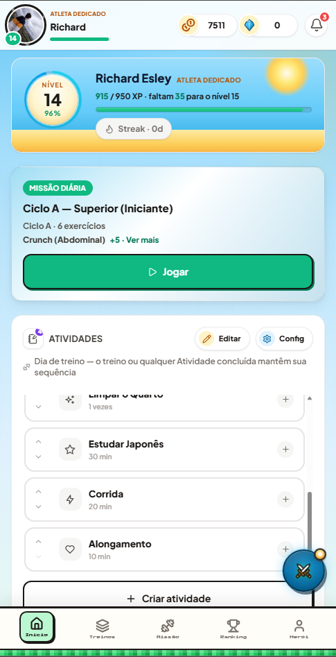
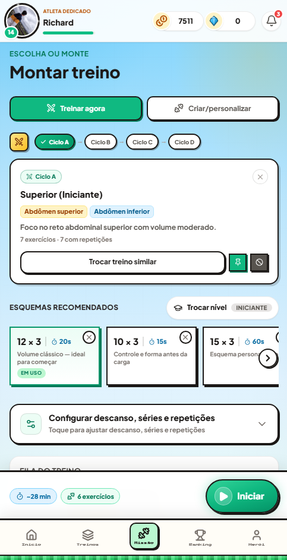
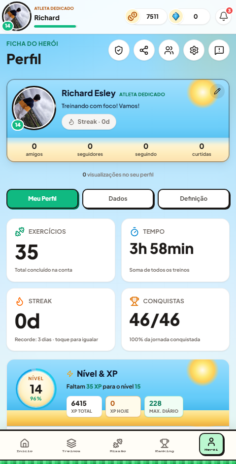

<div align="center">


# ⚔️ Evolyn · Core Quest

### Plantando a sua evolução.

O **Evolyn** é um aplicativo gamificado de treinos em casa que combina exercícios, evolução, recompensas, atividades e desafios para tornar a constância muito mais divertida.

[](https://abdoria-project.vercel.app)
[](https://github.com/RDEsley/Evolyn-Core-Quest/releases)
[](./LICENSE)
[](https://github.com/RDEsley/Evolyn-Core-Quest/actions/workflows/ci.yml)

<br>

[🌐 Demonstração](https://abdoria-project.vercel.app) •
[📖 Guia do usuário](./docs/GUIA-DO-USUARIO.md) •
[🚀 CI/CD](./docs/DEPLOYMENT.md) •
[⚙️ Instalação](#️-instalação) •
[👨‍💻 Desenvolvedor](#-desenvolvedor)

</div>

---

## 🎯 Sobre o projeto

O **Evolyn · Core Quest** foi criado para ajudar pessoas a manterem uma rotina de exercícios por meio de uma experiência inspirada em jogos.

No aplicativo, o usuário pode seguir missões guiadas de abdômen e core, acumular experiência,
desbloquear conquistas, disputar posições no ranking e acompanhar sua evolução.

Mais do que registrar exercícios, o Evolyn transforma cada treino em progresso dentro de uma aventura.

> 🩺 O Evolyn possui finalidade educacional e de entretenimento. Ele não substitui o acompanhamento de profissionais de saúde ou educação física.

---

## ✨ Principais funcionalidades

### 💪 Treinos personalizados

* Biblioteca com exercícios focados em abdômen e core
* Treinos prontos nas intensidades Leve, Moderado e Evolyn
* Criação de rotinas personalizadas
* Organização dos exercícios por arrastar e soltar
* Configuração individual de séries, repetições, duração e descanso direto na fila
* Exercícios realizados por tempo ou repetições
* Timer de descanso e execução guiada
* Recuperação automática da sessão exatamente no exercício, série, lado e cronômetro em que parou
* Tela mantida ativa durante o Player em dispositivos compatíveis
* Plano de core com intensidade, agenda, pacote de som e descanso entre séries sincronizados às Opções e ao Player
* Instalação como PWA pelo menu do Perfil, com orientação específica quando o navegador não oferece o prompt nativo
* Catálogo inteiramente baseado em movimentos de peso corporal, sem acessórios
* Sistema de favoritos, preferências e bloqueios de recomendação
* Exercícios fixados somados a todas as recomendações, sem substituir a fila-base

### 🎮 Progressão gamificada

* Experiência e evolução de nível
* Sequência de dias treinados
* Conquistas e recompensas
* Folhas verdes como moeda de progressão e Folhas douradas como recurso premium do futuro MyPlant
* Ranking global, semanal e entre amigos
* Perfil público com estatísticas e personalizações
* Calendário com histórico de atividades

### 🌱 MyPlant

O **MyPlant** ocupa uma aba própria na navegação e está sendo preparado como uma nova
experiência mobile. A implementação anterior de RPG AFK foi retirada do runtime e preservada,
com código e imagens, em [`Exploracao-rpg-afk`](./Exploracao-rpg-afk/README.md).

### 🏆 Rankings e comunidade

O sistema competitivo permite comparar o progresso dos jogadores por:

* **XP semanal** — experiência conquistada desde o último domingo
* **XP global** — experiência acumulada durante toda a jornada
* **Folhas semanais** — Folhas conquistadas na semana, sem descontar compras
* **Folhas globais** — total vitalício de Folhas conquistadas
* **Dias seguidos (semanal)** — sequência de treinos atualmente ativa
* **Dias seguidos (global)** — maior sequência já alcançada pelo jogador
* Ranking entre amigos

Os rankings são competitivos e não concedem recompensas por posição. Os personagens fictícios usados para compor a comunidade permanecem visíveis como jogadores inativos, com streak atual e recorde zerados, sem conquistas de streak.

Os jogadores também podem acessar perfis públicos, acompanhar conquistas e interagir com a comunidade.

### 📝 Atividades e organização pessoal

Além dos treinos, o Evolyn oferece ferramentas para ajudar na rotina:

* Atividades de leitura, estudo, corrida, meditação e alongamento
* Agenda configurável por dia da semana
* Lista de tarefas personalizada
* Histórico das atividades concluídas
* Recompensas por manter hábitos saudáveis
* Suporte para dias de descanso
* Notificações pessoais com data única ou recorrência, múltiplos horários, ícone, cor e som

Atividades, Bloco de Notas, notificações pessoais e histórico visual ficam reunidos na página
**Atividades**. A caixa de entrada exibe apenas avisos internos do sistema. O mapa de campanha e as conquistas
recentes ficam no **Início**. A navegação principal
(**Início, Atividades, Missão, MyPlant e Perfil**) permanece fixa em todo o aplicativo, exceto
durante o player de treino. Biblioteca e Ranking são atalhos da página **Missão**.

### 🎨 Personalização

Cada jogador pode construir sua própria identidade dentro do aplicativo utilizando:

* Fotos de perfil
* Bordas
* Banners
* Títulos
* Efeitos visuais
* Sons
* Cosméticos
* Recompensas especiais

Grande parte das personalizações é desbloqueada por conquistas, eventos e códigos especiais.

---

## 🚀 Por que usar o Evolyn?

<table>
<tr>
<td width="50%" valign="top">

### 🏠 Treine onde estiver

Exercícios desenvolvidos para serem realizados principalmente em casa e utilizando o peso corporal.

</td>
<td width="50%" valign="top">

### 🎯 Mantenha o foco

Metas, streaks, conquistas e recompensas ajudam a transformar o treino em um hábito.

</td>
</tr>

<tr>
<td width="50%" valign="top">

### ⚔️ Evolua jogando

Cada atividade contribui para o crescimento do perfil e para a progressão da jornada.

</td>
<td width="50%" valign="top">

### 📊 Acompanhe seu progresso

Visualize estatísticas, calendário, zonas musculares trabalhadas e histórico de atividades.

</td>
</tr>
</table>

---

## 🕹️ Como funciona?

O ciclo principal do Evolyn é simples:

```text
Escolha ou monte um treino
            ↓
Execute os exercícios
            ↓
Ganhe experiência e moedas
            ↓
Suba de nível
            ↓
Desbloqueie conquistas e itens
            ↓
Evolua sua jornada e seu perfil
```

O usuário também pode concluir atividades pessoais, acompanhar a campanha, competir nos rankings e personalizar sua experiência.

---

## 🖼️ Preview

<div align="center">




<br>



</div>

---

## 🧩 Tecnologias utilizadas

<div align="center">


</div>

### Principais tecnologias

* **React 19** para construção da interface
* **TypeScript** para segurança e organização do código
* **Vite** para desenvolvimento e build
* **Tailwind CSS** para estilização
* **Framer Motion** para animações
* **Node.js e Express** no backend
* **Supabase Postgres** como banco de dados
* **JWT** para autenticação
* **Vercel** para hospedagem e funções serverless

---

## 🗂️ Estrutura do projeto

```text
Evolyn/
├── client/                 # Interface React
├── server/src/
│   ├── domain/             # Regras e entidades de domínio
│   ├── repositories/       # Acesso ao banco de dados
│   ├── routes/             # Rotas da API
│   ├── services/           # Regras de negócio
│   └── db/seeds/           # Dados iniciais
├── shared/
│   ├── types/              # Tipagens compartilhadas
│   └── utils/              # Funções auxiliares
├── supabase/migrations/    # Migrações do banco de dados
├── api/                    # Entrada serverless da Vercel
├── android/                # Projeto nativo Android (Capacitor)
├── ios/                    # Projeto nativo iOS (Capacitor)
├── docs/                   # Documentação
├── Exploracao-rpg-afk/     # Snapshot independente do jogo antigo
└── scripts/                # Scripts de configuração e manutenção
```

---

## ⚙️ Instalação

### Pré-requisitos

Antes de começar, tenha instalado:

* [Node.js](https://nodejs.org/) 22.x
* Git
* Uma conta e um projeto no [Supabase](https://supabase.com/)

### Clone o repositório

```bash
git clone https://github.com/RDEsley/Evolyn-Core-Quest.git
cd Evolyn
```

### Instale as dependências

```bash
npm install
```

### Configure as variáveis de ambiente

Copie o arquivo de exemplo:

```bash
cp server/.env.example server/.env
```

Configure as seguintes variáveis:

```env
SUPABASE_URL=
SUPABASE_SERVICE_ROLE_KEY=
SUPABASE_ANON_KEY=
JWT_SECRET=
JWT_EXPIRES_IN=7d
```

> 🔐 Nunca exponha a chave `SUPABASE_SERVICE_ROLE_KEY` no frontend ou em arquivos públicos.

### Configure o banco de dados

Aplique as migrações disponíveis na pasta:

```text
supabase/migrations/
```

Também é possível utilizar o Supabase CLI:

```bash
supabase db push
```

### Popule os dados iniciais

```bash
npm run seed
```

### Inicie o projeto

```bash
npm run dev
```

O projeto ficará disponível nos seguintes endereços:

| Serviço       | Endereço                           |
| ------------- | ---------------------------------- |
| Aplicação     | `http://localhost:5173`            |
| API           | `http://localhost:3001`            |
| Status da API | `http://localhost:3001/api/health` |

---

## 📜 Scripts principais

| Comando                | Descrição                            |
| ---------------------- | ------------------------------------ |
| `npm run dev`          | Inicia o frontend e o backend        |
| `npm run build`        | Gera a versão de produção            |
| `npm run build:vercel` | Executa o build para a Vercel        |
| `npm run format:check` | Valida a formatação                   |
| `npm run lint`         | Executa a análise estática            |
| `npm test`             | Executa os testes do servidor         |
| `npm run cap:sync`     | Sincroniza os projetos Android e iOS  |
| `npm run seed`         | Popula o banco com dados iniciais    |
| `npm run setup`        | Executa o assistente de configuração |

---

## ☁️ Deploy

O projeto está preparado para deploy contínuo na **Vercel**.

### Configuração do projeto

```text
Install Command: npm install
Build Command: npm run build:vercel
Node.js: 22.x
```

Configure no painel da Vercel as variáveis de ambiente utilizadas pelo backend.

Após o deploy, confirme o funcionamento da API acessando:

```text
/api/health
```

### Produção

🌐 **Aplicação:**
https://abdoria-project.vercel.app

---

## 📚 Documentação

| Documento                                    | Descrição                                        |
| -------------------------------------------- | ------------------------------------------------ |
| [Guia do usuário](./docs/GUIA-DO-USUARIO.md) | Orientações para quem utiliza o aplicativo       |
| [Guia de contribuição](./CONTRIBUTING.md)    | Informações para desenvolvedores e colaboradores |
| [Identidade visual](./docs/BRANDING.md)       | Logos, favicons, PWA e assets nativos             |
| [Preparação Capacitor](./docs/CAPACITOR-READINESS.md) | Estado e pendências dos aplicativos nativos |
| [CI/CD e deploy](./docs/DEPLOYMENT.md)        | Gates, branches, Vercel e migrations              |
| [Licença](./LICENSE)                         | Termos de uso do projeto                         |

---

## 🤝 Contribuindo

Contribuições são bem-vindas.

Para contribuir:

1. Faça um fork do projeto
2. Crie uma nova branch
3. Realize suas alterações
4. Faça o commit
5. Envie a branch
6. Abra um Pull Request

```bash
git checkout -b feature/minha-funcionalidade
git commit -m "feat: adiciona nova funcionalidade"
git push origin feature/minha-funcionalidade
```

Consulte o arquivo [CONTRIBUTING.md](./CONTRIBUTING.md) para mais informações.

---

## 🗺️ Próximos passos

* Novos exercícios e treinos
* Novos movimentos de peso corporal e cosméticos
* Eventos e recompensas especiais
* Expansão das funcionalidades sociais
* Melhorias no acompanhamento de progresso
* Lançamento da nova experiência MyPlant

---

## 📄 Licença

Este projeto está sob a licença **MIT**.

Consulte o arquivo [LICENSE](./LICENSE) para mais detalhes.

---

## 👨‍💻 Desenvolvedor

<div align="center">


### Richard Esley

**Desenvolvedor Full Stack · UI/UX**

[](https://richardesley-dev.vercel.app/)
[](https://github.com/RDEsley)
[](https://www.linkedin.com/in/richardesley/)

</div>

---

<div align="center">

### ⚔️ Treine. Evolua. Conquiste.

**Feito para transformar consistência em diversão.**

<br>

[🌐 Abrir o aplicativo](https://abdoria-project.vercel.app) •
[🐛 Reportar um problema](https://github.com/RDEsley/Evolyn-Core-Quest/issues) •
[📖 Guia do usuário](./docs/GUIA-DO-USUARIO.md)

<br><br>

⭐ Considere deixar uma estrela no repositório caso tenha gostado do projeto.

</div>
